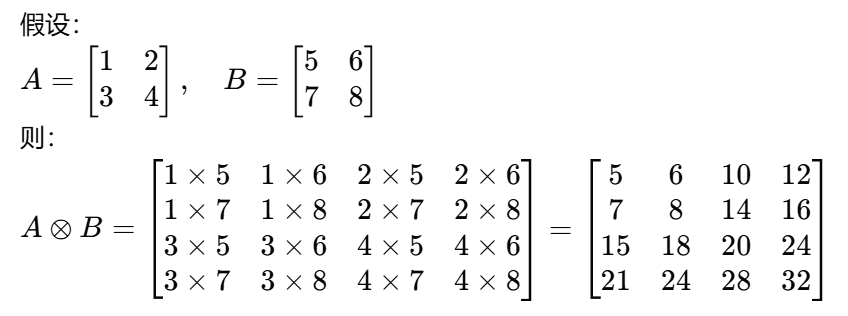
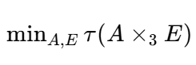

## 11

### 11/3

【今日心得】敢于和不同层次、阶级的人交换信息；

#### 背景知识

##### 丰度图

* 丰度图（Abundance Maps）是高光谱成像和光谱解混领域中的一个概念

* 在高光谱图像中，每个像素点的光谱信息可以看作是多种物质光谱的线性组合。丰度图就是用来表示这些物质在每个像素中所占比例的图像。

#### 数学

##### 三维张量积

##### 最小化

【理解】

* minA,E表示找到最小的A、E使得，后面的τ函数最小
* 本质上还是使用梯度下降最小化函数值；

## 符号

φ：表示一种规则，用于

ψ：

arg min f(x)：表示当f(x)最小的时候，参数的分布；