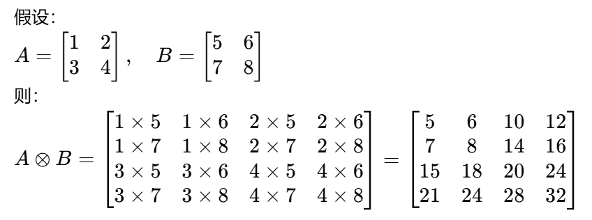
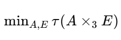

## 11

### 11/3

【今日心得】敢于和不同层次、阶级的人交换信息；

#### 背景知识

##### 丰度图

* 丰度图（Abundance Maps）是高光谱成像和光谱解混领域中的一个概念

* 在高光谱图像中，每个像素点的光谱信息可以看作是多种物质光谱的线性组合。丰度图就是用来表示这些物质在每个像素中所占比例的图像。

#### 数学

##### 三维张量积

`来源：`CVPR论文

##### 最小化

【理解】

* minA,E表示找到最小的A、E使得，后面的τ函数最小
* 本质上还是使用梯度下降最小化函数值；

### 11/30

#### 数值积分

* 对于不能用牛顿-莱布尼茨公式求积分的问题，用数值的方法求积分；
* 通过矩形公式，积分的近似；

##### 求积公式

加权平均值；通过代数的形式，来判断一个求积公式是否可行；

`代数精度：`求积公式对尽可能多的函数成立；代数精度越高越好；

`精确成立：`求方程组的唯一解；

##### 插值型求积公式

* 准确成立的，也就是方程组存在唯一解；

$R(f)=I-I_n=\int_a^b[f(x)-L_n(x)]\mathrm{d}x$
拉格朗日求积公式；

##### 牛顿-科特斯公式

* 将积分区间划分n等分

##### 辛普森公式

`余项：`

​																$-\frac{1}{90}h^{5}f^{(4)}(3)$

- [ ] 辛普森公式不是二个区间吗，怎么是四阶导？

##### 梯形公式和复化梯形

【理解】复化梯形

* 将一个大区间拆分成为若干个小区间，对每一个小区间使用梯形公式；
* 复化梯形公式的推导和复化梯形公式误差的计算；
* 误差限是有绝对值的；

【公式】

​								$\int_{a}^{b}f(x)dx=\frac{h}{2}[f(a)+f(b)+2\sum_{k=1}^{n-1}f(x_{k})]$

【误差】

​														$=-\frac{(b-a)h^{2}}{12}f^{\prime\prime}(s)$

## 12

### 12/2

#### 矩阵论

##### 约尔旦标准型

【时间】2024年12月2日09:24:36

`约旦块：`一个上三角矩阵，主对角元素为特征值，超对角线上的元素为1，其他元素为0；

分块矩阵中各个块是约旦块，则称其为约旦标准型；

`代数重数：`通过特征值多项式求解出来的特征值的重复度，即为代数重数；

`几何重数:`通过代入特征值，计算$A - \lambda E$，得到的特征向量的个数，即为几何重数；
计算公式为：$n - R(A)$；其中n是方阵的行或列数，R(A)表示矩阵的秩；

* 行列式的计算，学会按行按列展开后计算，需要添加对应的负号；
* 通过特征多项式求解出来的，特征值如果重复了，那么这个重复度称为代数重数；
* 几何重数表示了对应特征值在特征空间的维数；
  理解：为什么几何重数是由n-r(A)确定的，n表示未知数个数，r(A)表示真正起作用的方程数，几何重数表示空间中几何的情况其由未定方程决定；
* 几何重数  决定  约尔旦块的个数；
* 代数重数  决定  约尔旦块的大小；

****

【题型1】将普通矩阵转换为约尔旦标准型；

`步骤：`①求解代数重数决定约尔旦块的大小；②求解几何重数决定约尔旦块的的个数；③组合对应的约尔旦标准型；（按照特征值的顺序）

`作用：`①一个约尔旦块对应一个特征值；

##### 奇异值分解

【时间】2024年12月2日10:43:39

`奇异值分解公式：`$A=U\Sigma V^T$

* 对于方阵而言，特征值可以反应矩阵在不同维度上的拉伸和压缩特性；对于非方阵而言，奇异值可以反应矩阵在不同维度上的拉伸和压缩特性；
* 非方阵$A_{m\times n}$而言，其奇异值是$A^{T}A$的特征值开根号；
* $A^{T}A$具有n个非负实数特征值；
* 奇异值和特征值一样可以反应矩阵的秩；

****

【题型1】求奇异值；

`步骤：`①求出$A^{T}A$矩阵；②求出该矩阵的特征值；③对求出的特征值开根号，得到奇异值；

`作用：`①可以用于SVD分解和PCA降维分析；

****

【题型2】对非方阵进行奇异值分解

`步骤：`①奇异值中的V矩阵时，进行对角化的矩阵V；②U矩阵的计算公式，$U=AV\Sigma^{-1}$

`作用：`①数据的降维和压缩；

##### Hermite矩阵

【时间】

`初学时疑惑：`①Hermite标准型和施密特标准型的区别？
Hermite是行最简形的操作，施密特标准型就是施密特正交化得到的矩阵；

`定义:`Hermite矩阵是共轭转置矩阵；$(A^T)^- = A^*$；

* 复数模的求法：$|a+bi| = \sqrt{a^2+b^2}$；
* 共轭的求法：主部不变，虚部取反；共轭只处理虚部；
* 共轭转置的求法：①先转置，再求共轭；

$A=
\begin{pmatrix}
1+2i & 3-4i \\
5+6i & 7-8i
\end{pmatrix}$       	$A^*=
\begin{pmatrix}
1-2i & 5-6i \\
3+4i & 7+8i
\end{pmatrix}$

* Hermite矩阵是广义形式的实对称矩阵，当虚部退化时，就是实对称矩阵；
* 满足A^H = A时，才是真正的Hermite矩阵；

****

【题型1】求矩阵的Hermite标准型

`步骤：`①求行最简形；

##### 满秩分解

$A\in\mathbf{C}_{r}^{m\times n}$

`初学时疑惑：`①满秩指的是什么？

`定义：`A在满秩的情况下，可以被拆分为两个矩阵的乘积；

* 满秩指的是，矩阵行列式不为0；

****

【题型1】求矩阵A的满秩分解

步骤：①求A矩阵的前r列，构成矩阵F；②求A矩阵对应的Hermite矩阵的前r行，构成矩阵G；③验证F*G是否等于矩阵A；

#### 广义逆

##### 广义逆

`初学时疑惑：`①广义+逆和广义-逆分别是什么；②如何用广义逆判断方程组是否有解

##### 伪逆

`背景:`非方阵是不能取逆的；矩阵的行列式为0的矩阵，也称为奇异矩阵，它是没有逆的；

`伪逆公式：`$A^{+}$

* 奇异矩阵是行列式值为0的矩阵，奇异值矩阵是通过奇异值分解得到的矩阵；
* 伪逆是一种广义逆，适用于任意的情况；
* 矩阵的广义逆是不唯一的；

****

【题型1】广义减逆

`步骤：`①创建一个四分块矩阵，左上为原矩阵，右上为记录其行变换矩阵（单位阵），左下为记录其列变换矩阵（单位阵），右下为矩阵；②将左上化为行最简形，行记录单位阵变化后的矩阵；将化为行最简形的矩阵，化为列最简形，得到列单位阵变化后的矩阵；

## 符号

φ：表示一种规则，用于

ψ：

arg min f(x)：表示当f(x)最小的时候，参数的分布；